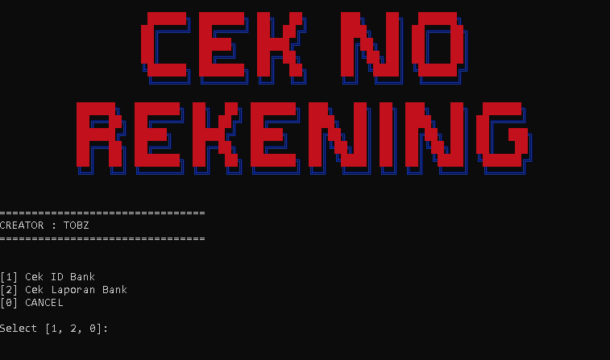

<div align="center">
  
  
# CEK NOMOR REKENING BANK
  
---
</div>

## Description

- [ ID ] Ini adalah sebuah tools untuk mengecek laporan pada rekening bank
- [ EN ] This is a tools to cek reports on bank accounts

## Installation

# For Windows

- Download [NodeJS](https://nodejs.org/en/)
- Download [Git](https://git-scm.com/downloads)

```bash
$ git clone https://github.com/TobyG74/CekRekeningBank.git
$ npm install
$ npm start
or
$ node index
```

# For Termux

```bash
$ apt-get update 
$ apt-get upgrade -y
$ apt install git -y
$ apt install nodejs -y
$ git clone https://github.com/TobyG74/CekRekeningBank.git
$ cd CekRekeningBank
$ npm install
$ npm start
or
$ node index
```
